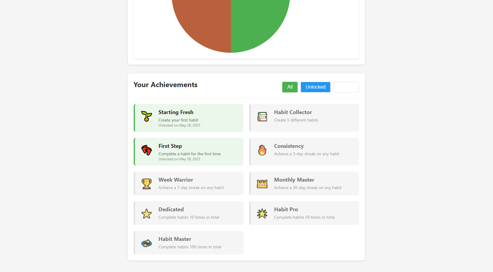

# Habit Tracker App

A comprehensive React with TypeScript application for tracking and visualizing habits and personal progress over time.

## Github repository

https://github.com/martiiponsaa/Enginyeria-de-Prompts-Lab6.git

## Project Structure

```
├── src/                # Source code
│   ├── components/     # React components
│   │   ├── Counter.tsx # Counter component with state
│   │   ├── Header.tsx  # Header component 
│   │   └── Navigation.tsx # Navigation bar component
│   ├── contexts/       # React Context providers
│   │   └── ThemeContext.tsx # Theme context for styling
│   ├── pages/          # Page components
│   │   ├── HomePage.tsx # Home page component
│   │   └── AboutPage.tsx # About page component
│   ├── services/       # Service classes
│   │   └── example.service.ts # Example service
│   ├── App.tsx         # Main App component with routing
│   ├── index.tsx       # React entry point
│   ├── index.css       # Global styles
│   └── types.ts        # TypeScript type definitions
├── public/             # Static assets
│   ├── index.html      # HTML entry point
│   └── manifest.json   # Web app manifest
├── package.json        # Project dependencies and scripts
├── tsconfig.json       # TypeScript configuration
├── .gitignore          # Git ignore file
└── README.md           # Documentation
```

## Getting Started

### Prerequisites

- Node.js (v14 or later)
- TypeScript
- React and React DOM
- React Router (for navigation)

### Installation

1. Install TypeScript globally (if not already installed):
   ```
   npm install -g typescript
   ```

2. Install project dependencies:
   ```
   npm install
   ```

### Development

- Change the PowerShell execution policy:
  ```
  Set-ExecutionPolicy -Scope CurrentUser -ExecutionPolicy RemoteSigned  
  ```

- Build the project for production:
  ```
  npm run build
  ```

- Run the development server:
  ```
  npm start
  ```

## Features

### Habit Management
- Create and track multiple habits with customizable frequencies
- Mark habits as complete with a simple interface
- View current streaks and progress metrics
- Delete or edit habits as needed

### Visualization and Statistics
- Interactive charts powered by Chart.js showing habit completion trends
- Compliance calendar for visualizing progress patterns
- Detailed statistics for each habit including streaks and completion history
- Period selectors (week, month, year) for different data views

### User Experience
- Clean, intuitive interface with responsive design
- Dark mode / light mode theme switching
- Achievement system to motivate consistent habit building
- User-friendly notifications for actions and updates

## Screenshots

### Dashboard


*Main dashboard showing habit overview and daily progress*

### My Habits


*My Habits page*

### Stats




*Stats Page*

### About


*About Page*

## Used Prompts

Throughout the development of this application, we used GitHub Copilot with various prompts to streamline the development process. Here are some examples:

### Feature Implementation Prompts

1. **Create the structure for a typescrips app**
```
We wanted the app to be coded in typescript combined with react, so first we asked for the base.
```

2. **I also want to use react combined with typescript**
```
Once we have the file structure for typescript we asked to implement react, so that copilot has a base where to start.
```

3. **Asked Copilot to fix some errors**
```
Prompt:

There are two errors, one in ThemeContext.tsx: Cannot find module './types' or its corresponding type declarations.ts(2307)

And in tsconfig.json: Cannot find type definition file for 'babel__core'.
The file is in the program because:
Entry point for implicit type library 'babel__core'ts
Cannot find type definition file for 'babel__generator'.
The file is in the program because:
Entry point for implicit type library 'babel__generator'ts
Cannot find type definition file for 'babel__template'.
The file is in the program because:
Entry point for implicit type library 'babel__template'ts
```

4. **I want to test if the structure works, deploy this app locally**
```
We wanted to see how to deploy the website, so we asked for a little demo to test if everything was going right.
```

5. **Asked to develop user story 1 for the habit tracker**
```
Prompt:

Now that we've got the structure, I want you to code some user sotries, 4 in total. Here is the first one with it's acceptance criteria:

As a user, I want to define personal habits to keep track of my routines.
Acceptance Criteria:
 The functionality must be available in the main interface.
 The user must be able to undo the action if necessary.
 The system must confirm the action with a message afterward.
 All data must be saved correctly and remain accessible afterward.

With this prompt Copilot spend a lot of time working and did the whole app without any errors. It worked for over an hour.
```

## Lessons Learned About Using Copilot

### Effective Approaches

1. **Specific, Detailed Prompts**
   - Being specific about desired features and functionality yielded better results
   - Including technical details like library names and specific methods helped generate more accurate code

2. **Iterative Development**
   - Breaking down complex features into smaller components worked well
   - Asking Copilot to refine existing code rather than rewriting from scratch